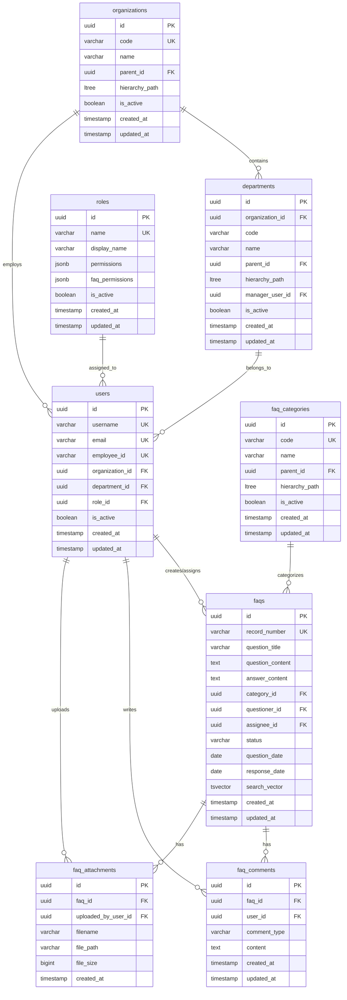

# FAQ・ユーザー管理スキーマ設計書

## 1. 概要

health_centerプロジェクトにおけるFAQ管理とユーザー管理のためのデータベーススキーマ設計書です。
既存のFAQ.csvデータを基に、効率的な検索・管理機能を提供するスキーマを設計します。

## 2. 要件分析

### 2.1 FAQ.csvデータ分析

#### 現在のCSVフィールド構造
| フィールド名 | データ型 | 説明 | 例 |
|-------------|----------|------|-----|
| 記録番号 | VARCHAR(50) | 一意の問い合わせ識別番号 | IIJI-20220607-000042 |
| 質問発生日 | DATE | 問い合わせが発生した日付 | 2022/6/7 |
| 対応日 | DATE | 対応を完了した日付 | 2022/6/8 |
| 質問者 | VARCHAR(200) | 問い合わせを行った担当者名 | FJJ）2広域HCデ事）吉田 |
| 対応エンジニア | VARCHAR(200) | 対応したエンジニア名 | HOPE/Xサポートセンター）塚本 |
| パッケージ | VARCHAR(100) | 関連するソフトウェアパッケージ | HOPE X-W V10 |
| 質問カテゴリ | VARCHAR(50) | 問い合わせの分類 | 画面表示、収納・請求 |
| 質問内容 | TEXT | 問い合わせの詳細内容 | 会計カード画面の表示異常について... |
| 回答内容 | TEXT | 対応内容・回答 | 初回はクライアント側リソース不足として回答... |
| 解決状況 | VARCHAR(20) | 対応状況 | 解決済み、対応中 |
| 障害番号 | VARCHAR(50) | 関連する障害管理番号 | SU-4331→3K-1468 |
| 備考 | TEXT | 追加情報・特記事項 | 2024/10に3K-1468として正式化 |

#### 質問カテゴリ分析
```
- 会計カード：会計入力・修正関連
- レセプト：レセプト作成・提出関連  
- DPC：DPC制度・分岐関連
- 収納・請求：収納業務・請求書関連
- マスタ：各種マスタ設定関連
- 統計・DWH：統計処理・データ分析関連
- 処方・オーダ：処方・オーダリング関連
- 病名：病名登録・管理関連
- 外来：外来業務全般
- 入院：入院業務全般
- システム：システム障害・環境設定関連
- 帳票：帳票出力・印刷関連
- 画面表示：画面表示不具合関連
- その他：上記に分類されないその他
```

### 2.2 機能要件

#### FAQ管理機能
1. **基本CRUD操作**
   - FAQ項目の登録・更新・削除・検索
   - カテゴリ別分類管理
   - 解決状況の追跡

2. **検索・フィルタリング**
   - キーワード検索（全文検索）
   - カテゴリ別絞り込み
   - 日付範囲検索
   - 解決状況別検索

3. **関連性管理**
   - 障害番号との関連付け
   - 類似FAQ の推奨
   - タグ管理

#### ユーザー管理機能
1. **基本ユーザー管理**
   - 質問者・対応者の管理
   - 組織・部署情報
   - 連絡先情報

2. **権限管理**
   - ロールベースアクセス制御
   - FAQ閲覧・編集権限
   - 管理者権限

## 3. スキーマ設計

### 3.1 FAQテーブル群

#### 3.1.1 faqs（FAQ管理）
```sql
CREATE TABLE faqs (
    -- 基本識別情報
    id UUID PRIMARY KEY DEFAULT gen_random_uuid(),
    record_number VARCHAR(50) NOT NULL UNIQUE,
    
    -- 質問・回答情報
    question_title VARCHAR(500) NOT NULL,
    question_content TEXT NOT NULL,
    answer_content TEXT,
    
    -- 分類情報
    category_id UUID NOT NULL REFERENCES faq_categories(id),
    package_name VARCHAR(100),
    tags JSONB DEFAULT '[]',
    
    -- 関連情報
    related_ticket_number VARCHAR(100),
    related_faq_ids UUID[] DEFAULT '{}',
    
    -- 状態管理
    status VARCHAR(20) NOT NULL DEFAULT 'open' CHECK (status IN ('open', 'in_progress', 'resolved', 'closed')),
    priority VARCHAR(10) DEFAULT 'medium' CHECK (priority IN ('low', 'medium', 'high', 'critical')),
    
    -- 担当者情報
    questioner_id UUID REFERENCES users(id),
    assignee_id UUID REFERENCES users(id),
    
    -- 統計情報
    view_count INTEGER DEFAULT 0,
    helpful_count INTEGER DEFAULT 0,
    not_helpful_count INTEGER DEFAULT 0,
    
    -- 日付情報
    question_date DATE NOT NULL,
    response_date DATE,
    resolved_date DATE,
    
    -- メタデータ
    metadata JSONB DEFAULT '{}',
    search_vector TSVECTOR,
    
    -- タイムスタンプ
    created_at TIMESTAMP WITH TIME ZONE DEFAULT CURRENT_TIMESTAMP,
    updated_at TIMESTAMP WITH TIME ZONE DEFAULT CURRENT_TIMESTAMP,
    
    -- 制約
    CONSTRAINT faqs_dates_logical CHECK (
        (response_date IS NULL OR response_date >= question_date) AND
        (resolved_date IS NULL OR resolved_date >= question_date)
    )
);

-- インデックス
CREATE INDEX idx_faqs_record_number ON faqs(record_number);
CREATE INDEX idx_faqs_category_id ON faqs(category_id);
CREATE INDEX idx_faqs_status ON faqs(status, created_at DESC);
CREATE INDEX idx_faqs_questioner_id ON faqs(questioner_id);
CREATE INDEX idx_faqs_assignee_id ON faqs(assignee_id);
CREATE INDEX idx_faqs_question_date ON faqs(question_date DESC);
CREATE INDEX idx_faqs_package_name ON faqs(package_name) WHERE package_name IS NOT NULL;
CREATE INDEX idx_faqs_priority_status ON faqs(priority, status);

-- 全文検索インデックス
CREATE INDEX idx_faqs_search_vector ON faqs USING GIN(search_vector);
CREATE INDEX idx_faqs_tags ON faqs USING GIN(tags);
CREATE INDEX idx_faqs_related_ids ON faqs USING GIN(related_faq_ids);

-- 全文検索用トリガー
CREATE OR REPLACE FUNCTION update_faq_search_vector()
RETURNS TRIGGER AS $$
BEGIN
    NEW.search_vector := to_tsvector('japanese',
        COALESCE(NEW.question_title, '') || ' ' ||
        COALESCE(NEW.question_content, '') || ' ' ||
        COALESCE(NEW.answer_content, '') || ' ' ||
        COALESCE(NEW.package_name, '')
    );
    RETURN NEW;
END;
$$ LANGUAGE plpgsql;

CREATE TRIGGER faqs_search_vector_update
    BEFORE INSERT OR UPDATE ON faqs
    FOR EACH ROW EXECUTE FUNCTION update_faq_search_vector();
```

#### 3.1.2 faq_categories（FAQカテゴリ）
```sql
CREATE TABLE faq_categories (
    -- 基本情報
    id UUID PRIMARY KEY DEFAULT gen_random_uuid(),
    code VARCHAR(50) NOT NULL UNIQUE,
    name VARCHAR(100) NOT NULL,
    description TEXT,
    
    -- 階層構造
    parent_id UUID REFERENCES faq_categories(id),
    hierarchy_path LTREE,
    level INTEGER DEFAULT 0,
    sort_order INTEGER DEFAULT 0,
    
    -- 表示設定
    color_code VARCHAR(7), -- HEXカラーコード
    icon_name VARCHAR(50),
    is_active BOOLEAN DEFAULT TRUE,
    
    -- 統計情報
    faq_count INTEGER DEFAULT 0,
    
    -- タイムスタンプ
    created_at TIMESTAMP WITH TIME ZONE DEFAULT CURRENT_TIMESTAMP,
    updated_at TIMESTAMP WITH TIME ZONE DEFAULT CURRENT_TIMESTAMP,
    
    -- 制約
    CONSTRAINT categories_no_self_parent CHECK (id != parent_id),
    CONSTRAINT categories_color_format CHECK (color_code ~ '^#[0-9A-Fa-f]{6}$')
);

-- インデックス
CREATE INDEX idx_categories_code ON faq_categories(code);
CREATE INDEX idx_categories_parent_id ON faq_categories(parent_id);
CREATE INDEX idx_categories_hierarchy_path ON faq_categories USING GIST(hierarchy_path);
CREATE INDEX idx_categories_active_sort ON faq_categories(is_active, sort_order);
```

#### 3.1.3 faq_comments（FAQ コメント・履歴）
```sql
CREATE TABLE faq_comments (
    -- 基本情報
    id UUID PRIMARY KEY DEFAULT gen_random_uuid(),
    faq_id UUID NOT NULL REFERENCES faqs(id) ON DELETE CASCADE,
    user_id UUID NOT NULL REFERENCES users(id),
    
    -- コメント内容
    comment_type VARCHAR(20) DEFAULT 'comment' CHECK (comment_type IN ('comment', 'status_change', 'assignment', 'resolution')),
    content TEXT NOT NULL,
    
    -- 状態変更情報（status_change の場合）
    old_status VARCHAR(20),
    new_status VARCHAR(20),
    
    -- 添付ファイル
    attachments JSONB DEFAULT '[]',
    
    -- メタデータ
    metadata JSONB DEFAULT '{}',
    
    -- タイムスタンプ
    created_at TIMESTAMP WITH TIME ZONE DEFAULT CURRENT_TIMESTAMP,
    updated_at TIMESTAMP WITH TIME ZONE DEFAULT CURRENT_TIMESTAMP
);

-- インデックス
CREATE INDEX idx_comments_faq_id ON faq_comments(faq_id, created_at DESC);
CREATE INDEX idx_comments_user_id ON faq_comments(user_id);
CREATE INDEX idx_comments_type ON faq_comments(comment_type);
```

#### 3.1.4 faq_attachments（FAQ添付ファイル）
```sql
CREATE TABLE faq_attachments (
    -- 基本情報
    id UUID PRIMARY KEY DEFAULT gen_random_uuid(),
    faq_id UUID NOT NULL REFERENCES faqs(id) ON DELETE CASCADE,
    uploaded_by_user_id UUID NOT NULL REFERENCES users(id),
    
    -- ファイル情報
    filename VARCHAR(255) NOT NULL,
    original_filename VARCHAR(255) NOT NULL,
    file_path VARCHAR(1000) NOT NULL,
    file_size BIGINT NOT NULL,
    mime_type VARCHAR(100) NOT NULL,
    file_hash VARCHAR(64), -- SHA-256ハッシュ
    
    -- メタデータ
    description TEXT,
    is_public BOOLEAN DEFAULT FALSE,
    
    -- タイムスタンプ
    created_at TIMESTAMP WITH TIME ZONE DEFAULT CURRENT_TIMESTAMP,
    
    -- 制約
    CONSTRAINT attachments_file_size_positive CHECK (file_size > 0)
);

-- インデックス
CREATE INDEX idx_attachments_faq_id ON faq_attachments(faq_id);
CREATE INDEX idx_attachments_uploaded_by ON faq_attachments(uploaded_by_user_id);
CREATE INDEX idx_attachments_filename ON faq_attachments(filename);
CREATE INDEX idx_attachments_hash ON faq_attachments(file_hash);
```

### 3.2 ユーザー管理テーブル群

#### 3.2.1 users（ユーザー管理）
```sql
CREATE TABLE users (
    -- 基本識別情報
    id UUID PRIMARY KEY DEFAULT gen_random_uuid(),
    username VARCHAR(50) NOT NULL UNIQUE,
    email VARCHAR(255) NOT NULL UNIQUE,
    
    -- プロフィール情報
    first_name VARCHAR(100),
    last_name VARCHAR(100),
    display_name VARCHAR(200),
    full_name_japanese VARCHAR(200), -- 日本語氏名
    employee_id VARCHAR(50) UNIQUE,
    
    -- 組織情報
    organization_id UUID REFERENCES organizations(id),
    department_id UUID REFERENCES departments(id),
    position_title VARCHAR(100),
    
    -- 連絡先情報
    phone_number VARCHAR(20),
    mobile_number VARCHAR(20),
    extension_number VARCHAR(10),
    
    -- 認証情報
    password_hash VARCHAR(255),
    password_salt VARCHAR(255),
    is_active BOOLEAN DEFAULT TRUE,
    is_verified BOOLEAN DEFAULT FALSE,
    
    -- ロール・権限
    role_id UUID NOT NULL REFERENCES roles(id),
    permissions JSONB DEFAULT '[]',
    
    -- 設定・プリファレンス
    timezone VARCHAR(50) DEFAULT 'Asia/Tokyo',
    language VARCHAR(10) DEFAULT 'ja',
    notification_preferences JSONB DEFAULT '{}',
    
    -- アバター・表示設定
    avatar_url VARCHAR(500),
    theme VARCHAR(20) DEFAULT 'light',
    
    -- 統計情報
    faqs_created_count INTEGER DEFAULT 0,
    faqs_resolved_count INTEGER DEFAULT 0,
    last_login_at TIMESTAMP WITH TIME ZONE,
    
    -- メタデータ
    metadata JSONB DEFAULT '{}',
    
    -- タイムスタンプ
    created_at TIMESTAMP WITH TIME ZONE DEFAULT CURRENT_TIMESTAMP,
    updated_at TIMESTAMP WITH TIME ZONE DEFAULT CURRENT_TIMESTAMP,
    
    -- 制約
    CONSTRAINT users_username_length CHECK (char_length(username) >= 3),
    CONSTRAINT users_email_format CHECK (email ~* '^[A-Za-z0-9._%+-]+@[A-Za-z0-9.-]+\.[A-Za-z]{2,}$')
);

-- インデックス
CREATE INDEX idx_users_username ON users(username);
CREATE INDEX idx_users_email ON users(email);
CREATE INDEX idx_users_employee_id ON users(employee_id) WHERE employee_id IS NOT NULL;
CREATE INDEX idx_users_organization_id ON users(organization_id);
CREATE INDEX idx_users_department_id ON users(department_id);
CREATE INDEX idx_users_role_id ON users(role_id);
CREATE INDEX idx_users_active ON users(is_active, is_verified);
CREATE INDEX idx_users_full_name ON users(full_name_japanese) WHERE full_name_japanese IS NOT NULL;

-- 全文検索用インデックス
CREATE INDEX idx_users_search ON users USING GIN(
    to_tsvector('japanese', 
        COALESCE(display_name, '') || ' ' ||
        COALESCE(full_name_japanese, '') || ' ' ||
        COALESCE(email, '') || ' ' ||
        COALESCE(employee_id, '')
    )
);
```

#### 3.2.2 organizations（組織）
```sql
CREATE TABLE organizations (
    -- 基本情報
    id UUID PRIMARY KEY DEFAULT gen_random_uuid(),
    code VARCHAR(20) NOT NULL UNIQUE,
    name VARCHAR(200) NOT NULL,
    name_short VARCHAR(100),
    name_english VARCHAR(200),
    
    -- 組織情報
    type VARCHAR(50) DEFAULT 'company', -- company, hospital, clinic, department
    parent_id UUID REFERENCES organizations(id),
    hierarchy_path LTREE,
    level INTEGER DEFAULT 0,
    
    -- 連絡先情報
    address TEXT,
    phone_number VARCHAR(20),
    fax_number VARCHAR(20),
    email VARCHAR(255),
    website_url VARCHAR(500),
    
    -- 状態管理
    is_active BOOLEAN DEFAULT TRUE,
    sort_order INTEGER DEFAULT 0,
    
    -- メタデータ
    metadata JSONB DEFAULT '{}',
    
    -- タイムスタンプ
    created_at TIMESTAMP WITH TIME ZONE DEFAULT CURRENT_TIMESTAMP,
    updated_at TIMESTAMP WITH TIME ZONE DEFAULT CURRENT_TIMESTAMP,
    
    -- 制約
    CONSTRAINT organizations_no_self_parent CHECK (id != parent_id)
);

-- インデックス
CREATE INDEX idx_organizations_code ON organizations(code);
CREATE INDEX idx_organizations_parent_id ON organizations(parent_id);
CREATE INDEX idx_organizations_hierarchy_path ON organizations USING GIST(hierarchy_path);
CREATE INDEX idx_organizations_type ON organizations(type);
CREATE INDEX idx_organizations_active_sort ON organizations(is_active, sort_order);
```

#### 3.2.3 departments（部署）
```sql
CREATE TABLE departments (
    -- 基本情報
    id UUID PRIMARY KEY DEFAULT gen_random_uuid(),
    organization_id UUID NOT NULL REFERENCES organizations(id),
    code VARCHAR(50) NOT NULL,
    name VARCHAR(200) NOT NULL,
    name_short VARCHAR(100),
    
    -- 階層構造
    parent_id UUID REFERENCES departments(id),
    hierarchy_path LTREE,
    level INTEGER DEFAULT 0,
    
    -- 部署情報
    department_type VARCHAR(50), -- medical, administrative, technical, support
    manager_user_id UUID REFERENCES users(id),
    
    -- 連絡先情報
    phone_number VARCHAR(20),
    extension_number VARCHAR(10),
    email VARCHAR(255),
    location VARCHAR(200),
    
    -- 状態管理
    is_active BOOLEAN DEFAULT TRUE,
    sort_order INTEGER DEFAULT 0,
    
    -- メタデータ
    metadata JSONB DEFAULT '{}',
    
    -- タイムスタンプ
    created_at TIMESTAMP WITH TIME ZONE DEFAULT CURRENT_TIMESTAMP,
    updated_at TIMESTAMP WITH TIME ZONE DEFAULT CURRENT_TIMESTAMP,
    
    -- 制約
    CONSTRAINT departments_no_self_parent CHECK (id != parent_id),
    CONSTRAINT departments_unique_code_per_org UNIQUE (organization_id, code)
);

-- インデックス
CREATE INDEX idx_departments_organization_id ON departments(organization_id);
CREATE INDEX idx_departments_code ON departments(organization_id, code);
CREATE INDEX idx_departments_parent_id ON departments(parent_id);
CREATE INDEX idx_departments_hierarchy_path ON departments USING GIST(hierarchy_path);
CREATE INDEX idx_departments_manager ON departments(manager_user_id);
CREATE INDEX idx_departments_type ON departments(department_type);
CREATE INDEX idx_departments_active_sort ON departments(is_active, sort_order);
```

#### 3.2.4 roles（ロール管理）
```sql
CREATE TABLE roles (
    -- 基本情報
    id UUID PRIMARY KEY DEFAULT gen_random_uuid(),
    name VARCHAR(50) NOT NULL UNIQUE,
    display_name VARCHAR(100) NOT NULL,
    description TEXT,
    
    -- ロール属性
    role_type VARCHAR(20) DEFAULT 'standard' CHECK (role_type IN ('system', 'standard', 'custom')),
    is_active BOOLEAN DEFAULT TRUE,
    priority INTEGER DEFAULT 0,
    
    -- 権限設定
    permissions JSONB DEFAULT '[]',
    faq_permissions JSONB DEFAULT '{}', -- FAQ特有の権限
    
    -- メタデータ
    metadata JSONB DEFAULT '{}',
    
    -- タイムスタンプ
    created_at TIMESTAMP WITH TIME ZONE DEFAULT CURRENT_TIMESTAMP,
    updated_at TIMESTAMP WITH TIME ZONE DEFAULT CURRENT_TIMESTAMP,
    
    -- 制約
    CONSTRAINT roles_priority_range CHECK (priority BETWEEN 0 AND 1000)
);

-- インデックス
CREATE INDEX idx_roles_name ON roles(name);
CREATE INDEX idx_roles_active_priority ON roles(is_active, priority DESC);
CREATE INDEX idx_roles_type ON roles(role_type);
```

## 4. テーブル関係図



## 5. 初期データ投入

### 5.1 FAQカテゴリの初期データ
```sql
INSERT INTO faq_categories (id, code, name, description, hierarchy_path, level, sort_order) VALUES
('10000000-0000-0000-0000-000000000001', 'ACCOUNTING', '会計カード', '会計入力・修正関連', '1', 0, 1),
('10000000-0000-0000-0000-000000000002', 'RECEIPT', 'レセプト', 'レセプト作成・提出関連', '2', 0, 2),
('10000000-0000-0000-0000-000000000003', 'DPC', 'DPC', 'DPC制度・分岐関連', '3', 0, 3),
('10000000-0000-0000-0000-000000000004', 'BILLING', '収納・請求', '収納業務・請求書関連', '4', 0, 4),
('10000000-0000-0000-0000-000000000005', 'MASTER', 'マスタ', '各種マスタ設定関連', '5', 0, 5),
('10000000-0000-0000-0000-000000000006', 'STATISTICS', '統計・DWH', '統計処理・データ分析関連', '6', 0, 6),
('10000000-0000-0000-0000-000000000007', 'PRESCRIPTION', '処方・オーダ', '処方・オーダリング関連', '7', 0, 7),
('10000000-0000-0000-0000-000000000008', 'DIAGNOSIS', '病名', '病名登録・管理関連', '8', 0, 8),
('10000000-0000-0000-0000-000000000009', 'OUTPATIENT', '外来', '外来業務全般', '9', 0, 9),
('10000000-0000-0000-0000-000000000010', 'INPATIENT', '入院', '入院業務全般', '10', 0, 10),
('10000000-0000-0000-0000-000000000011', 'SYSTEM', 'システム', 'システム障害・環境設定関連', '11', 0, 11),
('10000000-0000-0000-0000-000000000012', 'REPORT', '帳票', '帳票出力・印刷関連', '12', 0, 12),
('10000000-0000-0000-0000-000000000013', 'DISPLAY', '画面表示', '画面表示不具合関連', '13', 0, 13),
('10000000-0000-0000-0000-000000000014', 'OTHER', 'その他', '上記に分類されないその他', '14', 0, 14);
```

### 5.2 基本ロールの初期データ
```sql
INSERT INTO roles (id, name, display_name, description, permissions, faq_permissions) VALUES
('20000000-0000-0000-0000-000000000001', 'admin', 'システム管理者', 'すべての権限を持つ管理者', '["*"]', '{"read": true, "write": true, "delete": true, "manage_categories": true}'),
('20000000-0000-0000-0000-000000000002', 'support_engineer', 'サポートエンジニア', 'FAQ対応・管理権限', '["faq:*", "users:read"]', '{"read": true, "write": true, "assign": true, "resolve": true}'),
('20000000-0000-0000-0000-000000000003', 'questioner', '質問者', 'FAQ質問・閲覧権限', '["faq:read", "faq:create"]', '{"read": true, "create": true, "comment": true}'),
('20000000-0000-0000-0000-000000000004', 'viewer', '閲覧者', 'FAQ閲覧のみ権限', '["faq:read"]', '{"read": true}');
```

### 5.3 サンプル組織・部署データ
```sql
-- 組織
INSERT INTO organizations (id, code, name, name_short, type, hierarchy_path, level) VALUES
('30000000-0000-0000-0000-000000000001', 'MEDICAL_CORP', '医療法人健康センター', '健康センター', 'hospital', '1', 0);

-- 部署
INSERT INTO departments (id, organization_id, code, name, department_type, hierarchy_path, level) VALUES
('40000000-0000-0000-0000-000000000001', '30000000-0000-0000-0000-000000000001', 'IT_DEPT', 'IT部門', 'technical', '1.1', 1),
('40000000-0000-0000-0000-000000000002', '30000000-0000-0000-0000-000000000001', 'SUPPORT', 'サポートセンター', 'support', '1.2', 1),
('40000000-0000-0000-0000-000000000003', '30000000-0000-0000-0000-000000000001', 'MEDICAL', '医事課', 'administrative', '1.3', 1);
```

## 6. データマイグレーション

### 6.1 CSV→データベース移行スクリプト
```python
import pandas as pd
import psycopg2
from datetime import datetime
import uuid

def migrate_faq_csv_to_db():
    """FAQ.csvをデータベースに移行"""
    
    # CSVファイル読み込み
    df = pd.read_csv('FAQ.csv')
    
    # データベース接続
    conn = psycopg2.connect(
        host="localhost",
        database="health_center",
        user="postgres",
        password="postgres"
    )
    cur = conn.cursor()
    
    # カテゴリマッピング
    category_mapping = {
        '画面表示': '10000000-0000-0000-0000-000000000013',
        '収納・請求': '10000000-0000-0000-0000-000000000004',
        'DPC': '10000000-0000-0000-0000-000000000003',
        '統計・DWH': '10000000-0000-0000-0000-000000000006',
        'レセプト': '10000000-0000-0000-0000-000000000002',
        'マスタ': '10000000-0000-0000-0000-000000000005',
        '外来': '10000000-0000-0000-0000-000000000009',
        '入院': '10000000-0000-0000-0000-000000000010',
        'システム': '10000000-0000-0000-0000-000000000011',
        '会計カード': '10000000-0000-0000-0000-000000000001',
        'その他': '10000000-0000-0000-0000-000000000014'
    }
    
    for index, row in df.iterrows():
        if pd.isna(row['記録番号']) or row['記録番号'] == '':
            continue
            
        # FAQ データ準備
        faq_id = str(uuid.uuid4())
        category_id = category_mapping.get(row['質問カテゴリ'], category_mapping['その他'])
        
        # 状態判定
        status = 'resolved' if row['解決状況'] == '解決済み' else 'in_progress'
        
        # 日付変換
        question_date = pd.to_datetime(row['質問発生日'], format='%Y/%m/%d').date()
        response_date = None
        if pd.notna(row['対応日']):
            response_date = pd.to_datetime(row['対応日'], format='%Y/%m/%d').date()
        
        # FAQ挿入
        cur.execute("""
            INSERT INTO faqs (
                id, record_number, question_title, question_content, 
                answer_content, category_id, package_name, status,
                question_date, response_date, related_ticket_number,
                metadata, created_at, updated_at
            ) VALUES (
                %s, %s, %s, %s, %s, %s, %s, %s, %s, %s, %s, %s, %s, %s
            )
        """, (
            faq_id,
            row['記録番号'],
            row['質問内容'][:500] if pd.notna(row['質問内容']) else 'タイトル未設定',
            row['質問内容'] if pd.notna(row['質問内容']) else '',
            row['回答内容'] if pd.notna(row['回答内容']) else '',
            category_id,
            row['パッケージ'] if pd.notna(row['パッケージ']) else None,
            status,
            question_date,
            response_date,
            row['障害番号'] if pd.notna(row['障害番号']) else None,
            {'備考': row['備考'] if pd.notna(row['備考']) else ''},
            datetime.now(),
            datetime.now()
        ))
    
    conn.commit()
    cur.close()
    conn.close()
    print(f"Migrated {len(df)} FAQ records to database")
```

## 7. 検索・分析機能

### 7.1 全文検索クエリ例
```sql
-- キーワード検索
SELECT f.*, fc.name as category_name
FROM faqs f
JOIN faq_categories fc ON f.category_id = fc.id
WHERE f.search_vector @@ plainto_tsquery('japanese', '会計カード 表示')
ORDER BY ts_rank(f.search_vector, plainto_tsquery('japanese', '会計カード 表示')) DESC;

-- 複合条件検索
SELECT f.*, fc.name as category_name, 
       u1.display_name as questioner_name,
       u2.display_name as assignee_name
FROM faqs f
JOIN faq_categories fc ON f.category_id = fc.id
LEFT JOIN users u1 ON f.questioner_id = u1.id
LEFT JOIN users u2 ON f.assignee_id = u2.id
WHERE f.status = 'resolved'
  AND f.question_date BETWEEN '2022-01-01' AND '2022-12-31'
  AND fc.code IN ('ACCOUNTING', 'DISPLAY')
ORDER BY f.question_date DESC;
```

### 7.2 統計分析クエリ例
```sql
-- カテゴリ別FAQ統計
SELECT 
    fc.name as category_name,
    COUNT(*) as total_faqs,
    COUNT(*) FILTER (WHERE f.status = 'resolved') as resolved_count,
    COUNT(*) FILTER (WHERE f.status = 'in_progress') as in_progress_count,
    ROUND(AVG(EXTRACT(days FROM f.response_date - f.question_date)), 2) as avg_response_days
FROM faqs f
JOIN faq_categories fc ON f.category_id = fc.id
GROUP BY fc.id, fc.name
ORDER BY total_faqs DESC;

-- 月別FAQ発生傾向
SELECT 
    DATE_TRUNC('month', question_date) as month,
    COUNT(*) as faq_count,
    COUNT(*) FILTER (WHERE status = 'resolved') as resolved_count
FROM faqs
WHERE question_date >= '2022-01-01'
GROUP BY DATE_TRUNC('month', question_date)
ORDER BY month;
```

## 8. パフォーマンス最適化

### 8.1 インデックス最適化
```sql
-- 複合インデックス（よく使用される検索条件）
CREATE INDEX idx_faqs_category_status_date ON faqs(category_id, status, question_date DESC);
CREATE INDEX idx_faqs_assignee_status ON faqs(assignee_id, status) WHERE assignee_id IS NOT NULL;

-- 部分インデックス（特定条件のみ）
CREATE INDEX idx_faqs_unresolved ON faqs(question_date DESC) WHERE status IN ('open', 'in_progress');
CREATE INDEX idx_faqs_with_tickets ON faqs(related_ticket_number) WHERE related_ticket_number IS NOT NULL;
```

### 8.2 パーティショニング（大量データ対応）
```sql
-- 日付ベースパーティショニング
CREATE TABLE faqs_partitioned (
    LIKE faqs INCLUDING ALL
) PARTITION BY RANGE (question_date);

-- 年別パーティション
CREATE TABLE faqs_2022 PARTITION OF faqs_partitioned
    FOR VALUES FROM ('2022-01-01') TO ('2023-01-01');
CREATE TABLE faqs_2023 PARTITION OF faqs_partitioned
    FOR VALUES FROM ('2023-01-01') TO ('2024-01-01');
CREATE TABLE faqs_2024 PARTITION OF faqs_partitioned
    FOR VALUES FROM ('2024-01-01') TO ('2025-01-01');
```

## 9. セキュリティ・権限管理

### 9.1 行レベルセキュリティ（RLS）
```sql
-- FAQテーブルのRLS有効化
ALTER TABLE faqs ENABLE ROW LEVEL SECURITY;

-- 権限に基づくアクセス制御
CREATE POLICY faq_read_policy ON faqs
    FOR SELECT USING (
        -- 管理者は全て閲覧可能
        (SELECT role_id FROM users WHERE id = current_setting('app.current_user_id')::uuid) 
        IN (SELECT id FROM roles WHERE name = 'admin')
        OR
        -- 自分が作成したFAQは閲覧可能
        questioner_id = current_setting('app.current_user_id')::uuid
        OR
        -- 担当者は閲覧可能
        assignee_id = current_setting('app.current_user_id')::uuid
        OR
        -- 解決済みのFAQは誰でも閲覧可能
        status = 'resolved'
    );

CREATE POLICY faq_write_policy ON faqs
    FOR UPDATE USING (
        -- サポートエンジニア以上は更新可能
        (SELECT role_id FROM users WHERE id = current_setting('app.current_user_id')::uuid)
        IN (SELECT id FROM roles WHERE name IN ('admin', 'support_engineer'))
    );
```

### 9.2 監査ログ
```sql
-- FAQ変更履歴テーブル
CREATE TABLE faq_audit_logs (
    id BIGSERIAL PRIMARY KEY,
    faq_id UUID NOT NULL,
    user_id UUID NOT NULL,
    action VARCHAR(20) NOT NULL,
    old_values JSONB,
    new_values JSONB,
    ip_address INET,
    user_agent TEXT,
    created_at TIMESTAMP WITH TIME ZONE DEFAULT CURRENT_TIMESTAMP
);

-- 監査ログトリガー
CREATE OR REPLACE FUNCTION log_faq_changes()
RETURNS TRIGGER AS $$
BEGIN
    INSERT INTO faq_audit_logs (
        faq_id, user_id, action, old_values, new_values, ip_address
    ) VALUES (
        COALESCE(NEW.id, OLD.id),
        current_setting('app.current_user_id')::uuid,
        TG_OP,
        to_jsonb(OLD),
        to_jsonb(NEW),
        inet_client_addr()
    );
    RETURN COALESCE(NEW, OLD);
END;
$$ LANGUAGE plpgsql;

CREATE TRIGGER faq_audit_trigger
    AFTER INSERT OR UPDATE OR DELETE ON faqs
    FOR EACH ROW EXECUTE FUNCTION log_faq_changes();
```

## 10. 運用・メンテナンス

### 10.1 定期メンテナンスタスク
```sql
-- 統計情報更新
ANALYZE faqs, users, faq_categories, faq_comments;

-- 全文検索統計更新
UPDATE faqs SET search_vector = to_tsvector('japanese',
    COALESCE(question_title, '') || ' ' ||
    COALESCE(question_content, '') || ' ' ||
    COALESCE(answer_content, '') || ' ' ||
    COALESCE(package_name, '')
) WHERE updated_at > CURRENT_DATE - INTERVAL '1 day';

-- 古いセッション・一時データクリーンアップ
DELETE FROM faq_audit_logs WHERE created_at < CURRENT_DATE - INTERVAL '2 years';
```

### 10.2 バックアップ戦略
```bash
# 日次バックアップ
pg_dump -h localhost -U postgres -d health_center \
  --table=faqs --table=faq_categories --table=faq_comments \
  --table=faq_attachments --table=users --table=organizations \
  --table=departments --table=roles \
  --format=custom --file=faq_system_backup_$(date +%Y%m%d).dump

# 週次フルバックアップ
pg_dump -h localhost -U postgres -d health_center \
  --format=custom --file=full_backup_$(date +%Y%m%d).dump
```

この設計により、効率的で拡張性の高いFAQ・ユーザー管理システムを構築できます。既存のCSVデータを活用しながら、将来の機能拡張にも対応可能な設計となっています。
