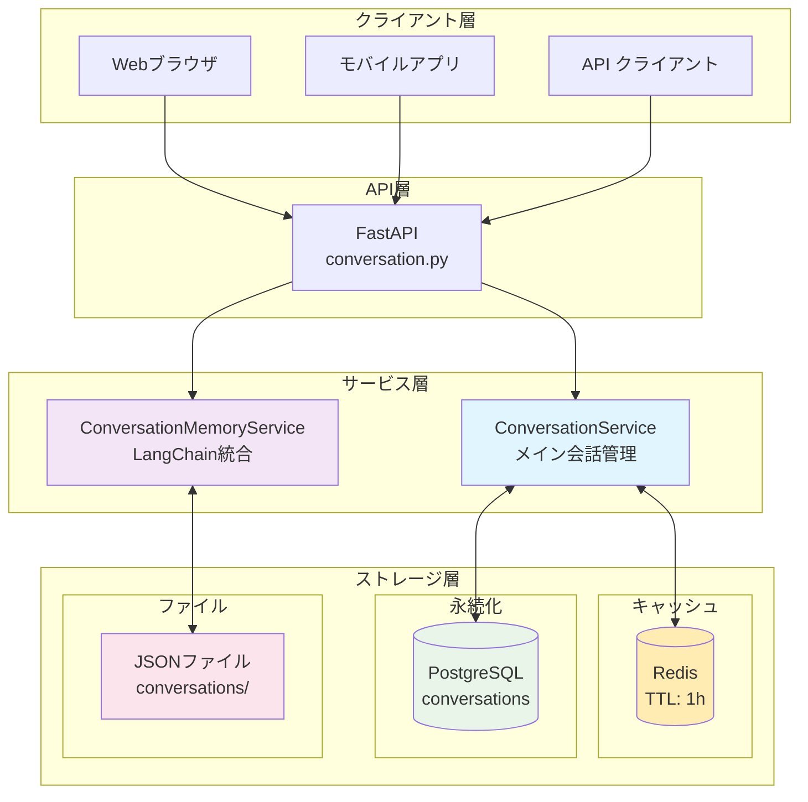
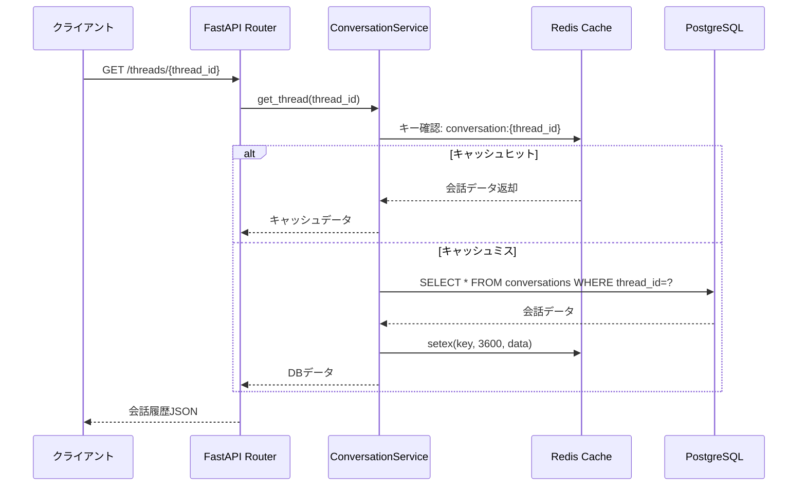
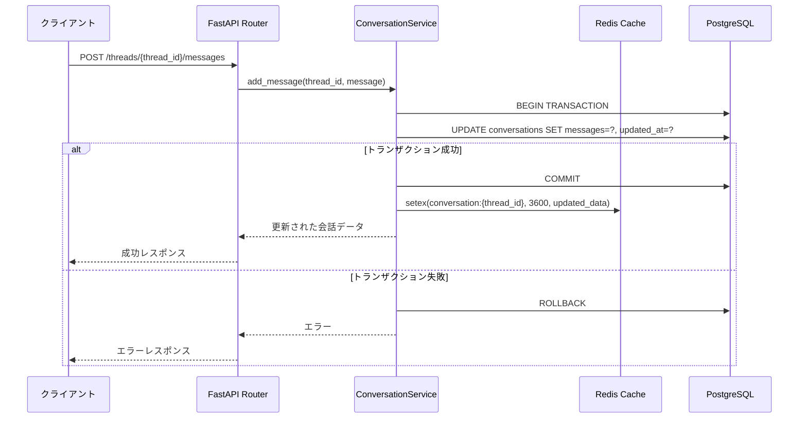
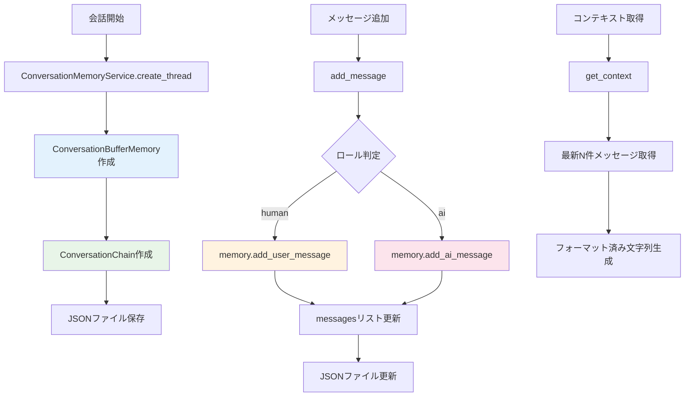
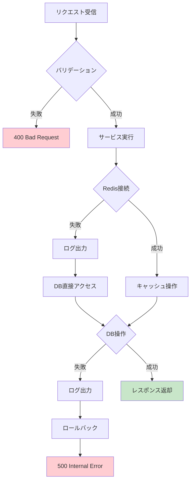

# 会話履歴の保存方法について

現在のhealth_centerプロジェクトでは、会話履歴が **ハイブリッド方式** で保存されています。以下に詳細を説明します。

## 保存方式の概要

### 1. **メインストレージ：PostgreSQLデータベース**
- **テーブル**: `conversations`
- **主要フィールド**:
  - `id`: プライマリキー（UUID）
  - `thread_id`: 会話スレッドID（UUID、インデックス付き）
  - `title`: 会話のタイトル
  - `messages`: メッセージ配列（JSON型）
  - `is_active`: 論理削除フラグ
  - `created_at`, `updated_at`: タイムスタンプ
  - `message_count`: メッセージ数

### 2. **キャッシュレイヤー：Redis**
- **目的**: 高速アクセスとセッション管理
- **キー形式**: `conversation:{thread_id}`
- **TTL**: 3600秒（1時間）
- **データ**: 完全な会話データをJSON形式で保存

### 3. **ファイルベース（レガシー）：JSONファイル**
- **場所**: `/backend/conversations/` ディレクトリ
- **形式**: `{thread_id}.json`
- **用途**: LangChainベースの会話メモリサービス用

## データフロー

### 全体アーキテクチャ図


### 読み取りフロー（GET操作）


### 書き込みフロー（POST操作）


### LangChain統合フロー


### エラーハンドリングフロー


## 具体的な保存内容

### メッセージ構造
```json
{
  "id": "test-save-note",
  "thread_id": "uuid-string",
  "title": "健康管理システムについて教えてください",
  "created_at": "2025-08-29T18:03:33.370468",
  "updated_at": "2025-08-29T18:03:47.611722",
  "message_count": 4,
  "messages": [
    {
      "role": "human",
      "content": "健康管理システムについて教えてください",
      "timestamp": "2025-08-29T18:03:33.370900"
    },
    {
      "role": "ai",
      "content": "回答内容...",
      "timestamp": "2025-08-29T18:03:33.371153",
      "metadata": {
        "sources": [...],
        "search_type": "database",
        "search_results": 10,
        "used_reranking": true
      }
    }
  ]
}
```

## 実装詳細

### データベースモデル（SQLAlchemy）
```python
class Conversation(Base):
    __tablename__ = "conversations"

    id = Column(UUID(as_uuid=True), primary_key=True, default=uuid.uuid4)
    thread_id = Column(UUID(as_uuid=True), nullable=False, index=True)
    title = Column(String(255), nullable=False, default="新しい会話")
    messages = Column(JSON, nullable=False, default=list)
    is_active = Column(Boolean, default=True)
    created_at = Column(DateTime(timezone=True), server_default=func.now())
    updated_at = Column(DateTime(timezone=True), onupdate=func.now())
    message_count = Column(Integer, default=0)
```

### ConversationService主要機能
- **create_thread()**: 新規スレッド作成
- **get_thread()**: スレッド取得（Redis → PostgreSQL のフォールバック）
- **add_message()**: メッセージ追加とキャッシュ更新
- **list_threads()**: アクティブスレッド一覧取得
- **delete_thread()**: 論理削除実行

### Redis管理機能
- **_save_to_redis()**: データをRedisに保存（TTL付き）
- **_get_from_redis()**: Redisからデータ取得とTTL更新
- **_delete_from_redis()**: Redisからデータ削除

## API エンドポイント

| メソッド | エンドポイント | 説明 |
|---------|---------------|------|
| POST | `/threads` | 新規スレッド作成 |
| GET | `/threads` | スレッド一覧取得 |
| GET | `/threads/{thread_id}` | 特定スレッド取得 |
| POST | `/threads/{thread_id}/messages` | メッセージ追加 |
| PUT | `/threads/{thread_id}/title` | タイトル更新 |
| DELETE | `/threads/{thread_id}` | スレッド削除（論理削除） |
| DELETE | `/threads` | 全スレッドクリア |

## 会話メモリサービス（LangChain統合）

### ConversationMemoryService機能
- **LangChain統合**: ConversationBufferMemory使用
- **ファイル永続化**: JSONファイルでの保存
- **メモリ管理**: アクティブ会話のメモリ内管理
- **コンテキスト生成**: 会話履歴からのコンテキスト文字列生成

### 主要メソッド
- **create_thread()**: LangChainメモリ付きスレッド作成
- **add_message()**: メッセージ追加とメモリ更新
- **get_context()**: フォーマット済みコンテキスト取得
- **generate_title()**: 最初のメッセージからタイトル生成

## 利点と特徴

### パフォーマンス最適化
1. **Redisキャッシュ**: 高速アクセス（TTL: 1時間）
2. **PostgreSQL**: 永続化と複雑クエリ対応
3. **インデックス**: thread_idでの高速検索

### スケーラビリティ
1. **水平拡張**: データベースベース設計
2. **キャッシュ分散**: Redis Clusterで拡張可能
3. **論理削除**: データ整合性維持

### データ整合性
1. **トランザクション管理**: SQLAlchemyによる一貫性保証
2. **フォールバック機能**: Redis障害時のDB直接アクセス
3. **エラーハンドリング**: 適切なロールバック処理

## ファイル構成

### 主要ファイル
- `/backend/app/services/conversation_service.py` - メイン会話サービス
- `/backend/app/services/conversation_memory_service.py` - LangChain統合サービス
- `/backend/app/models/conversation.py` - データベースモデル
- `/backend/app/routers/conversation.py` - APIエンドポイント
- `/backend/conversations/*.json` - ファイルベース保存（レガシー）

### 設定
- **Redis接続**: `host='redis', port=6379, db=0`
- **セッションTTL**: 3600秒（1時間）
- **OpenAI統合**: GPT-4o-mini使用（conversation chains用）

## 今後の改善点

1. **パフォーマンス**:
   - メッセージのページネーション実装
   - 大量メッセージ時の分割保存

2. **機能拡張**:
   - メッセージ検索機能
   - 会話のカテゴリ分類
   - エクスポート機能

3. **運用**:
   - メトリクス収集
   - ログ分析
   - バックアップ戦略

この設計により、リアルタイムチャットの要件を満たしながら、データの永続化と高速アクセスを両立しています。
