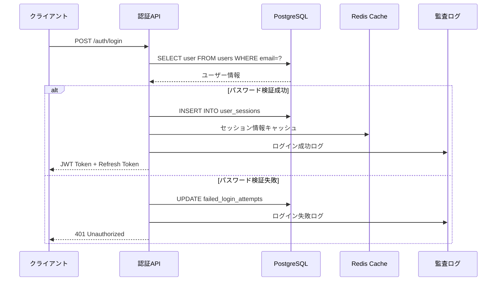
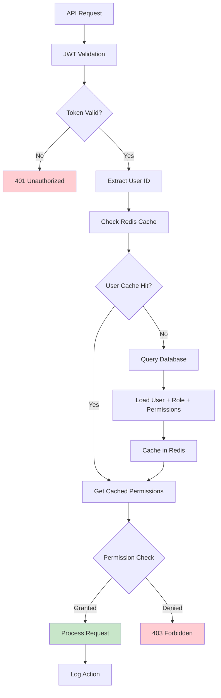

# ユーザー管理データベーススキーマ設計書

## 1. 概要

health_centerプロジェクトにユーザー管理機能を追加するためのデータベーススキーマ設計書です。
医療システムの要件に準拠し、セキュリティ、監査、スケーラビリティを考慮した設計を行います。

## 2. 設計方針

### 2.1 基本原則
- **セキュリティファースト**: 医療データの機密性保護
- **監査対応**: すべてのユーザー操作をトレース可能
- **スケーラビリティ**: 大規模展開に対応
- **GDPR準拠**: 個人情報保護規則への対応
- **PostgreSQL最適化**: 既存インフラとの整合性

### 2.2 既存システムとの整合性
- 既存テーブル: `conversations`, `notes`
- 命名規則: snake_case（PostgreSQL）
- 主キー: UUID型
- タイムスタンプ: timezone対応

## 3. 要件分析

### 3.1 機能要件
1. **基本ユーザー管理**
   - ユーザー登録・更新・削除
   - プロフィール管理
   - アカウント状態管理

2. **認証・認可**
   - JWT認証
   - ロールベースアクセス制御（RBAC）
   - 多要素認証（MFA）
   - セッション管理

3. **セキュリティ**
   - パスワードハッシュ化
   - ログイン試行制限
   - セキュリティ監査ログ

4. **医療システム要件**
   - 部署・診療科管理
   - 権限レベル管理
   - データアクセス制御

### 3.2 非機能要件
- **パフォーマンス**: 1000同時ユーザー対応
- **可用性**: 99.9%アップタイム
- **セキュリティ**: SOC2 Type II準拠
- **監査**: 完全な操作履歴記録

## 4. スキーマ設計

### 4.1 ユーザー管理テーブル群

#### 4.1.1 users（ユーザーマスタ）
```sql
CREATE TABLE users (
    -- 基本識別情報
    id UUID PRIMARY KEY DEFAULT gen_random_uuid(),
    username VARCHAR(50) NOT NULL UNIQUE,
    email VARCHAR(255) NOT NULL UNIQUE,
    
    -- プロフィール情報
    first_name VARCHAR(100) NOT NULL,
    last_name VARCHAR(100) NOT NULL,
    display_name VARCHAR(200),
    avatar_url VARCHAR(500),
    
    -- 認証情報
    password_hash VARCHAR(255) NOT NULL,
    password_salt VARCHAR(255) NOT NULL,
    password_reset_token VARCHAR(255),
    password_reset_expires TIMESTAMP WITH TIME ZONE,
    
    -- MFA設定
    mfa_enabled BOOLEAN NOT NULL DEFAULT FALSE,
    mfa_secret VARCHAR(255),
    mfa_backup_codes JSON,
    
    -- アカウント状態
    is_active BOOLEAN NOT NULL DEFAULT TRUE,
    is_verified BOOLEAN NOT NULL DEFAULT FALSE,
    is_locked BOOLEAN NOT NULL DEFAULT FALSE,
    locked_until TIMESTAMP WITH TIME ZONE,
    failed_login_attempts INTEGER NOT NULL DEFAULT 0,
    
    -- 医療システム固有情報
    employee_id VARCHAR(50) UNIQUE,
    license_number VARCHAR(100),
    department_id UUID REFERENCES departments(id),
    role_id UUID NOT NULL REFERENCES roles(id),
    
    -- メタデータ
    metadata JSONB NOT NULL DEFAULT '{}',
    preferences JSONB NOT NULL DEFAULT '{}',
    
    -- タイムスタンプ
    created_at TIMESTAMP WITH TIME ZONE NOT NULL DEFAULT CURRENT_TIMESTAMP,
    updated_at TIMESTAMP WITH TIME ZONE NOT NULL DEFAULT CURRENT_TIMESTAMP,
    last_login_at TIMESTAMP WITH TIME ZONE,
    email_verified_at TIMESTAMP WITH TIME ZONE,
    
    -- 制約
    CONSTRAINT users_username_length CHECK (char_length(username) >= 3),
    CONSTRAINT users_email_format CHECK (email ~* '^[A-Za-z0-9._%+-]+@[A-Za-z0-9.-]+\.[A-Za-z]{2,}$'),
    CONSTRAINT users_failed_attempts_positive CHECK (failed_login_attempts >= 0)
);

-- インデックス
CREATE INDEX idx_users_username ON users(username);
CREATE INDEX idx_users_email ON users(email);
CREATE INDEX idx_users_department_id ON users(department_id);
CREATE INDEX idx_users_role_id ON users(role_id);
CREATE INDEX idx_users_employee_id ON users(employee_id) WHERE employee_id IS NOT NULL;
CREATE INDEX idx_users_active_verified ON users(is_active, is_verified);
CREATE INDEX idx_users_created_at ON users(created_at DESC);
CREATE INDEX idx_users_last_login ON users(last_login_at DESC) WHERE last_login_at IS NOT NULL;

-- 部分インデックス
CREATE INDEX idx_users_locked ON users(id, locked_until) WHERE is_locked = TRUE;
CREATE INDEX idx_users_password_reset ON users(password_reset_token) WHERE password_reset_token IS NOT NULL;
```

#### 4.1.2 departments（部署管理）
```sql
CREATE TABLE departments (
    -- 基本情報
    id UUID PRIMARY KEY DEFAULT gen_random_uuid(),
    code VARCHAR(20) NOT NULL UNIQUE,
    name VARCHAR(100) NOT NULL,
    name_en VARCHAR(100),
    description TEXT,
    
    -- 階層構造
    parent_id UUID REFERENCES departments(id),
    hierarchy_path LTREE, -- PostgreSQL階層データ型
    level INTEGER NOT NULL DEFAULT 0,
    sort_order INTEGER NOT NULL DEFAULT 0,
    
    -- 状態管理
    is_active BOOLEAN NOT NULL DEFAULT TRUE,
    
    -- メタデータ
    metadata JSONB NOT NULL DEFAULT '{}',
    
    -- タイムスタンプ
    created_at TIMESTAMP WITH TIME ZONE NOT NULL DEFAULT CURRENT_TIMESTAMP,
    updated_at TIMESTAMP WITH TIME ZONE NOT NULL DEFAULT CURRENT_TIMESTAMP,
    
    -- 制約
    CONSTRAINT departments_code_format CHECK (code ~ '^[A-Z0-9_]+$'),
    CONSTRAINT departments_level_positive CHECK (level >= 0),
    CONSTRAINT departments_no_self_parent CHECK (id != parent_id)
);

-- インデックス
CREATE INDEX idx_departments_code ON departments(code);
CREATE INDEX idx_departments_parent_id ON departments(parent_id);
CREATE INDEX idx_departments_hierarchy_path ON departments USING GIST(hierarchy_path);
CREATE INDEX idx_departments_active ON departments(is_active, sort_order);
```

#### 4.1.3 roles（ロール管理）
```sql
CREATE TABLE roles (
    -- 基本情報
    id UUID PRIMARY KEY DEFAULT gen_random_uuid(),
    name VARCHAR(50) NOT NULL UNIQUE,
    display_name VARCHAR(100) NOT NULL,
    description TEXT,
    
    -- ロール属性
    is_system_role BOOLEAN NOT NULL DEFAULT FALSE,
    is_active BOOLEAN NOT NULL DEFAULT TRUE,
    priority INTEGER NOT NULL DEFAULT 0,
    
    -- 権限設定
    permissions JSONB NOT NULL DEFAULT '[]',
    restrictions JSONB NOT NULL DEFAULT '{}',
    
    -- メタデータ
    metadata JSONB NOT NULL DEFAULT '{}',
    
    -- タイムスタンプ
    created_at TIMESTAMP WITH TIME ZONE NOT NULL DEFAULT CURRENT_TIMESTAMP,
    updated_at TIMESTAMP WITH TIME ZONE NOT NULL DEFAULT CURRENT_TIMESTAMP,
    
    -- 制約
    CONSTRAINT roles_name_format CHECK (name ~ '^[a-z][a-z0-9_]*$'),
    CONSTRAINT roles_priority_range CHECK (priority BETWEEN 0 AND 1000)
);

-- インデックス
CREATE INDEX idx_roles_name ON roles(name);
CREATE INDEX idx_roles_active_priority ON roles(is_active, priority DESC);
CREATE INDEX idx_roles_system ON roles(is_system_role);
```

#### 4.1.4 user_sessions（セッション管理）
```sql
CREATE TABLE user_sessions (
    -- セッション識別
    id UUID PRIMARY KEY DEFAULT gen_random_uuid(),
    session_token VARCHAR(255) NOT NULL UNIQUE,
    refresh_token VARCHAR(255) UNIQUE,
    user_id UUID NOT NULL REFERENCES users(id) ON DELETE CASCADE,
    
    -- セッション情報
    device_info JSONB NOT NULL DEFAULT '{}',
    ip_address INET NOT NULL,
    user_agent TEXT,
    location_info JSONB,
    
    -- 状態管理
    is_active BOOLEAN NOT NULL DEFAULT TRUE,
    expires_at TIMESTAMP WITH TIME ZONE NOT NULL,
    last_activity_at TIMESTAMP WITH TIME ZONE NOT NULL DEFAULT CURRENT_TIMESTAMP,
    
    -- セキュリティ
    created_from VARCHAR(50), -- 'login', 'refresh', 'sso'
    security_flags JSONB NOT NULL DEFAULT '{}',
    
    -- タイムスタンプ
    created_at TIMESTAMP WITH TIME ZONE NOT NULL DEFAULT CURRENT_TIMESTAMP,
    updated_at TIMESTAMP WITH TIME ZONE NOT NULL DEFAULT CURRENT_TIMESTAMP,
    
    -- 制約
    CONSTRAINT sessions_expires_future CHECK (expires_at > created_at)
);

-- インデックス
CREATE INDEX idx_sessions_token ON user_sessions(session_token);
CREATE INDEX idx_sessions_refresh_token ON user_sessions(refresh_token) WHERE refresh_token IS NOT NULL;
CREATE INDEX idx_sessions_user_id ON user_sessions(user_id, is_active, expires_at);
CREATE INDEX idx_sessions_expires_at ON user_sessions(expires_at);
CREATE INDEX idx_sessions_ip_address ON user_sessions(ip_address);

-- 期限切れセッション自動削除のためのパーティション（オプション）
-- CREATE TABLE user_sessions_expired PARTITION OF user_sessions FOR VALUES FROM ('1900-01-01') TO (CURRENT_TIMESTAMP);
```

#### 4.1.5 audit_logs（監査ログ）
```sql
CREATE TABLE audit_logs (
    -- 基本識別
    id BIGSERIAL PRIMARY KEY,
    log_id UUID NOT NULL DEFAULT gen_random_uuid(),
    
    -- 操作情報
    user_id UUID REFERENCES users(id),
    session_id UUID REFERENCES user_sessions(id),
    action VARCHAR(100) NOT NULL,
    resource_type VARCHAR(50) NOT NULL,
    resource_id VARCHAR(255),
    
    -- 詳細情報
    details JSONB NOT NULL DEFAULT '{}',
    old_values JSONB,
    new_values JSONB,
    
    -- コンテキスト
    ip_address INET NOT NULL,
    user_agent TEXT,
    request_id UUID,
    
    -- 結果
    status VARCHAR(20) NOT NULL DEFAULT 'success',
    error_message TEXT,
    
    -- タイムスタンプ
    created_at TIMESTAMP WITH TIME ZONE NOT NULL DEFAULT CURRENT_TIMESTAMP,
    
    -- 制約
    CONSTRAINT audit_status_values CHECK (status IN ('success', 'failure', 'partial'))
) PARTITION BY RANGE (created_at);

-- 月別パーティション作成例
CREATE TABLE audit_logs_2025_01 PARTITION OF audit_logs
    FOR VALUES FROM ('2025-01-01') TO ('2025-02-01');

-- インデックス
CREATE INDEX idx_audit_user_id ON audit_logs(user_id, created_at DESC);
CREATE INDEX idx_audit_action ON audit_logs(action, created_at DESC);
CREATE INDEX idx_audit_resource ON audit_logs(resource_type, resource_id);
CREATE INDEX idx_audit_created_at ON audit_logs(created_at DESC);
CREATE INDEX idx_audit_ip_address ON audit_logs(ip_address);
CREATE INDEX idx_audit_status ON audit_logs(status) WHERE status != 'success';
```

### 4.2 既存テーブルとの関係性

#### 4.2.1 conversations テーブルの拡張
```sql
-- 既存のconversationsテーブルにuser_id列を追加
ALTER TABLE conversations 
ADD COLUMN user_id UUID REFERENCES users(id),
ADD COLUMN created_by_user_id UUID REFERENCES users(id),
ADD COLUMN visibility VARCHAR(20) DEFAULT 'private' CHECK (visibility IN ('private', 'shared', 'public'));

-- インデックス追加
CREATE INDEX idx_conversations_user_id ON conversations(user_id);
CREATE INDEX idx_conversations_created_by ON conversations(created_by_user_id);
CREATE INDEX idx_conversations_visibility ON conversations(visibility, is_active);
```

#### 4.2.2 notes テーブルの拡張
```sql
-- 既存のnotesテーブルにuser_id列を追加
ALTER TABLE notes 
ADD COLUMN user_id UUID REFERENCES users(id),
ADD COLUMN created_by_user_id UUID REFERENCES users(id),
ADD COLUMN shared_with_departments UUID[] DEFAULT '{}',
ADD COLUMN access_level VARCHAR(20) DEFAULT 'private' CHECK (access_level IN ('private', 'department', 'public'));

-- インデックス追加
CREATE INDEX idx_notes_user_id ON notes(user_id);
CREATE INDEX idx_notes_created_by ON notes(created_by_user_id);
CREATE INDEX idx_notes_access_level ON notes(access_level, status);
CREATE INDEX idx_notes_departments ON notes USING GIN(shared_with_departments);
```

## 5. データフロー図

### 5.1 ユーザー認証フロー


### 5.2 権限チェックフロー


## 6. セキュリティ設計

### 6.1 パスワード管理
```sql
-- パスワードハッシュ化関数（アプリケーションレベル）
-- bcrypt + salt (cost=12) を使用
-- 例: $2b$12$LQv3c1yqBWVHxkd0LHAkCOYz6TtxMQJqhN8/LewdBPj/4bWBvqQGy
```

### 6.2 セッション管理
```sql
-- セッション自動クリーンアップ
CREATE OR REPLACE FUNCTION cleanup_expired_sessions()
RETURNS void AS $$
BEGIN
    DELETE FROM user_sessions 
    WHERE expires_at < CURRENT_TIMESTAMP 
       OR (last_activity_at < CURRENT_TIMESTAMP - INTERVAL '7 days');
END;
$$ LANGUAGE plpgsql;

-- 定期実行（cron job）
-- 0 */6 * * * psql -d health_center -c "SELECT cleanup_expired_sessions();"
```

### 6.3 監査ログ
```sql
-- 監査ログ自動記録トリガー
CREATE OR REPLACE FUNCTION audit_user_changes()
RETURNS TRIGGER AS $$
BEGIN
    INSERT INTO audit_logs (
        user_id, action, resource_type, resource_id,
        old_values, new_values, ip_address
    ) VALUES (
        COALESCE(NEW.id, OLD.id),
        TG_OP,
        'user',
        COALESCE(NEW.id::text, OLD.id::text),
        to_jsonb(OLD),
        to_jsonb(NEW),
        inet_client_addr()
    );
    
    RETURN COALESCE(NEW, OLD);
END;
$$ LANGUAGE plpgsql;

-- トリガー設定
CREATE TRIGGER users_audit_trigger
    AFTER INSERT OR UPDATE OR DELETE ON users
    FOR EACH ROW EXECUTE FUNCTION audit_user_changes();
```

## 7. パフォーマンス最適化

### 7.1 インデックス戦略
```sql
-- 複合インデックス（よく使われる組み合わせ）
CREATE INDEX idx_users_department_active ON users(department_id, is_active) 
    WHERE is_active = TRUE;

CREATE INDEX idx_sessions_user_active ON user_sessions(user_id, is_active, expires_at)
    WHERE is_active = TRUE;

-- 部分インデックス（条件付きデータのみ）
CREATE INDEX idx_users_mfa_enabled ON users(id) WHERE mfa_enabled = TRUE;
CREATE INDEX idx_users_locked ON users(id, locked_until) WHERE is_locked = TRUE;
```

### 7.2 クエリ最適化
```sql
-- ユーザー検索の最適化
CREATE INDEX idx_users_search ON users USING GIN(
    to_tsvector('english', 
        COALESCE(first_name, '') || ' ' || 
        COALESCE(last_name, '') || ' ' || 
        COALESCE(email, '') || ' ' || 
        COALESCE(employee_id, '')
    )
);

-- 部署階層検索の最適化（LTREE使用）
CREATE INDEX idx_departments_path_gist ON departments USING GIST(hierarchy_path);
```

## 8. データマイグレーション計画

### 8.1 マイグレーション順序
1. **Phase 1**: 基本テーブル作成
   - departments
   - roles
   - users

2. **Phase 2**: 関連テーブル作成
   - user_sessions
   - audit_logs

3. **Phase 3**: 既存テーブル拡張
   - conversations テーブル拡張
   - notes テーブル拡張

4. **Phase 4**: インデックス・制約追加
   - パフォーマンスインデックス
   - データ整合性制約

### 8.2 Alembicマイグレーションファイル例
```python
"""Create user management tables

Revision ID: 001_create_user_tables
Revises: 
Create Date: 2025-01-22 10:00:00.000000
"""
from alembic import op
import sqlalchemy as sa
from sqlalchemy.dialects import postgresql

# revision identifiers
revision = '001_create_user_tables'
down_revision = None
branch_labels = None
depends_on = None

def upgrade():
    # departments テーブル作成
    op.create_table('departments',
        sa.Column('id', postgresql.UUID(as_uuid=True), primary_key=True),
        sa.Column('code', sa.String(20), nullable=False, unique=True),
        sa.Column('name', sa.String(100), nullable=False),
        # ... 他のカラム定義
    )
    
    # roles テーブル作成
    op.create_table('roles',
        sa.Column('id', postgresql.UUID(as_uuid=True), primary_key=True),
        sa.Column('name', sa.String(50), nullable=False, unique=True),
        # ... 他のカラム定義
    )
    
    # users テーブル作成
    op.create_table('users',
        sa.Column('id', postgresql.UUID(as_uuid=True), primary_key=True),
        sa.Column('username', sa.String(50), nullable=False, unique=True),
        # ... 他のカラム定義
    )

def downgrade():
    op.drop_table('users')
    op.drop_table('roles')
    op.drop_table('departments')
```

## 9. 初期データ

### 9.1 システムロール
```sql
-- 基本ロール作成
INSERT INTO roles (id, name, display_name, description, is_system_role, permissions) VALUES
('00000000-0000-0000-0000-000000000001', 'super_admin', 'システム管理者', 'すべての権限を持つ最高管理者', TRUE, '["*"]'),
('00000000-0000-0000-0000-000000000002', 'admin', '管理者', '管理機能へのアクセス権限', TRUE, '["users:*", "departments:*", "roles:read"]'),
('00000000-0000-0000-0000-000000000003', 'doctor', '医師', '医師向け機能へのアクセス権限', TRUE, '["conversations:*", "notes:*", "patients:read"]'),
('00000000-0000-0000-0000-000000000004', 'nurse', '看護師', '看護師向け機能へのアクセス権限', TRUE, '["conversations:read", "notes:read", "patients:read"]'),
('00000000-0000-0000-0000-000000000005', 'support', 'サポート', 'システムサポート機能へのアクセス権限', TRUE, '["conversations:read", "users:read"]');
```

### 9.2 基本部署
```sql
-- 基本部署作成
INSERT INTO departments (id, code, name, hierarchy_path, level) VALUES
('10000000-0000-0000-0000-000000000001', 'ROOT', '医療法人', '1', 0),
('10000000-0000-0000-0000-000000000002', 'INTERNAL', '内科', '1.1', 1),
('10000000-0000-0000-0000-000000000003', 'SURGERY', '外科', '1.2', 1),
('10000000-0000-0000-0000-000000000004', 'ADMIN', '事務部', '1.3', 1),
('10000000-0000-0000-0000-000000000005', 'IT', 'IT部門', '1.4', 1);
```

## 10. 運用・メンテナンス

### 10.1 定期メンテナンス
```sql
-- 統計情報更新
ANALYZE users, departments, roles, user_sessions, audit_logs;

-- インデックス再構築（必要に応じて）
REINDEX TABLE users;

-- 古い監査ログのアーカイブ（月次）
SELECT partition_audit_logs_monthly();
```

### 10.2 監視項目
- アクティブユーザー数
- セッション数
- 失敗ログイン試行数
- データベースパフォーマンス
- 監査ログ量

### 10.3 バックアップ戦略
```bash
# 日次バックアップ
pg_dump -h localhost -U postgres -d health_center \
  --table=users --table=departments --table=roles \
  --table=user_sessions --table=audit_logs \
  --format=custom --file=user_data_backup_$(date +%Y%m%d).dump
```

## 11. 今後の拡張計画

### 11.1 短期的な拡張
- OAuth2.0/SAML対応
- API キー管理
- ユーザーグループ機能

### 11.2 中長期的な拡張
- 組織階層の複雑化対応
- 動的権限管理
- AI による異常検知

この設計により、セキュアで拡張性の高いユーザー管理システムを構築できます。医療システムの要件を満たしながら、将来の拡張にも対応可能な設計となっています。
